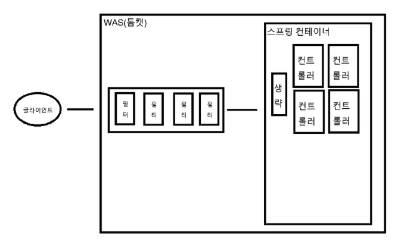
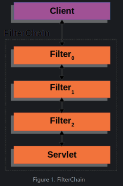
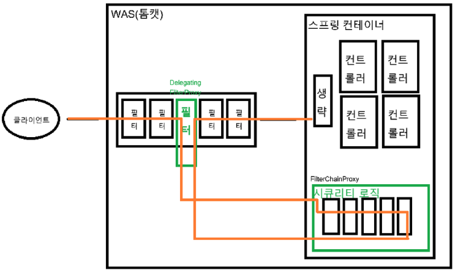
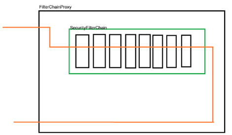
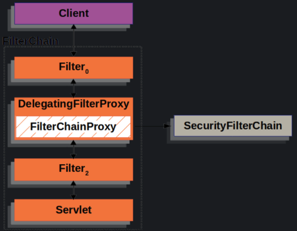
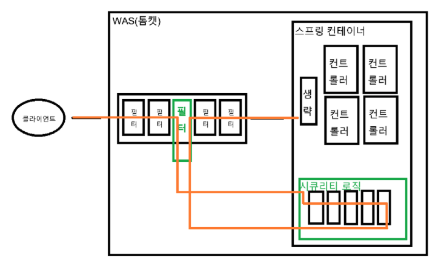
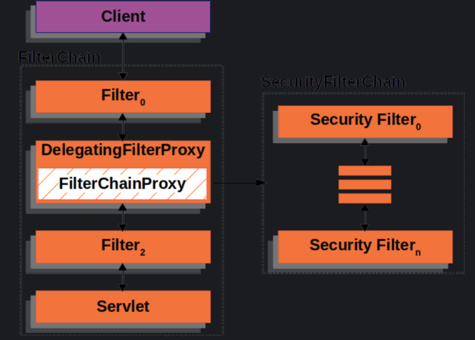
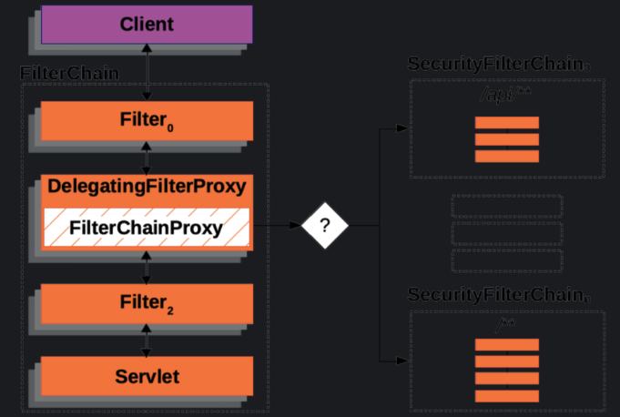

## Spring Security
    Spring Security란 Spring Framwork 기반 애플리케이션에 보안 기능을 제공하는 프레임워크이다. 주로 인증(Authentication)과 인가(Authorization)를 처리하며   
    웹 애플리 케이션의 보안을 강화하기 위한 다양한 기능을 제공한다.

    WAS의 필터에 하나의 필터를 만들어서 넣고 해당 필터에서 요청을 가로채며 가로챈 요청을 스프링 컨테이너 내부에 구현되어 있는 스프링 시큐리티 감시 로직을 거친다.
    시큐리티 로직을 마친 후 다시 WAS의 다음 필터로 복귀한다.
___

### Spring Architecture (Security dependency none)

클라이언트의 요청은 서버 컴퓨터의 WAS(톰캣)의 필터들을 통과한 뒤 스프링 컨테이너의 컨트롤러(Servelt)에 도달한다.


___

### Spring Architecture (Security dependency)



___
Security 의존성이 설정되어 있으면 클라이언트의 요청이 WAS를 통과하여 Spring 컨테이너에 도달하기 전에 Spring Security DelegatingFillterProxy의 FilterChainProxy 필터 체인을 거친다.


___

### SpringSecurity Logic

SpringSecurity 로직은 여러개의 필터들이 나열된 형태로 구성되어 있고 각 필터에서 CSRF, 로그인, 로그아웃, 인증, 인가 등 여러 작업을 수행한다.
___



___ 
SecurityFilterChain은 여러개를 가질 수 있기 때문에 특정 요청을 나눠서 따로 처리할 수 있다.

__

### Spring SecurityFilterChain
- DelegatingFilterProxy : 
    Was의 필터단에서 특정 필터를 추가해서 Spring 컨테이너로 요청을 가로채는 필터. -> Spring been을 찾아 요청을 넘겨주는 서블릿 필터

- FilterChainProxy : 
    DelegatingFilterProxy에서 가로챈 요청을 전달하는 곳이며 가로챈 요청을 SecurityFilterChain가 들고 있는 특정 
    SecurityFilterChain에게 요청을 넘겨 준다.-> DelegatingFilterProxy에 의해 호출되는 SecurityFilterChain들을 들고 있는 been

- SecurityFilterChain : 
    SpringSecurityFilter들의 묶음으로 실제 Security 로직이 처리 부분. -> FilterChainProxy가 SecurityFilterChain들을 들고 있다.


## Spring Security 기능 

### 인증(Authentication)
- 사용자가 누구인지 확인하는 과정
- 일반적으로 사용자 ID와 PASSWORD를 기반으로 인증이 수행됨

### 인증 방식
- HTTP Basic Authentication : 브라우저 기본 인증 창을 사용.
- Form-based Authentication : HTML 폼으로 사용자 입력 인증.
- OAuth2/OpenID Connect : 소셜 로그인 및 API 인증.

### 인가(Authoriztion)
- 인증된 사용자가 요청한 리소스에 접근할 권한이 있는지 확인.
- 역할(Role) 또는 권한(Authority)을 기반으로 접근을 제어.(Url, Method)

### Session 관리 
- Session은 클라이언트와 서버 간의 상태 정보를 유지하기 위한 기술.
- 클라이언트가 서버에 로그인하거나 특정 작업을 수행할 때, 서버는 클라이언트의 상태를 저장하기 위해 Session을 생성한다.

- Session 고정 공격 방지 : 
    악성 사용자가 의도적으로 생성한 세션 ID를 클라이언트가 사용하도록 유도해, 악성 사용자가 클라이언트의 Session을 탈취하는 공격을 방지하기 위해서 로그인시 새로운 Session ID를 생성한다.

```java
http
    .sessionManagement()
    .sessionFixation().newSession(); // 로그인 시 세션 ID를 새로 생성
```

- 동시 Session 제한 :
    하나의 사용자에 대해 하나의 Session을 유지할 수 있게 설정하여 동일 사용자가 여러 장치 또는 브라우저에서 로그인하지 못하도록 제한한다.

```java
http
    .sessionManagement()
    .maximumSessions(1) // 최대 1개의 세션 허용
    .expiredUrl("/session-expired"); // 세션 만료 시 리다이렉트 URL
```

- Session 정책 및 옵션 :
    Spring Security로 Application의 Session 생성 및 관리 방식을 정의할 수 있다.
    
    - always : 항상 새 세션 생성 -> 주로 보안 상 Session 고정 공격 방지에 초점을 둔다.
    ```java
    http
            .sessionManagement()
            .sessionCreationPolicy(SessionCreationPolicy.ALWAYS) // 요청 시마다 새 세션 생성
            .and()
            .authorizeHttpRequests()
            .antMatchers("/always/**").permitAll() // "/always" 경로는 모든 사용자 접근 허용
            .anyRequest().authenticated(); // 나머지 요청은 인증 필요
    ```
    ___

    - ifRequired : 요청에 세션이 필요할 때만 생성 (대부분의 웹에서 기본값으로 사용함) -> 요청에서 인증, 인가가 필요하지 않다면 Session을 생성하지 않아 효율적이다.
    ```java
     http
            .sessionManagement()
            .sessionCreationPolicy(SessionCreationPolicy.IF_REQUIRED) // 세션 필요 시에만 생성
            .and()
            .authorizeHttpRequests()
            .antMatchers("/ifRequired/**").permitAll() // "/ifRequired" 경로는 모든 사용자 접근 허용
            .anyRequest().authenticated();
    ```
    ___

    - never : 세션을 생성하지 않지만, 이미 존재하는 세션은 사용 -> Application이 세션을 필수로 요구하지 않을 때 적합.
    ```java
     http
            .sessionManagement()
            .sessionCreationPolicy(SessionCreationPolicy.NEVER) // 세션 생성 금지, 기존 세션만 사용
            .and()
            .authorizeHttpRequests()
            .antMatchers("/never/**").permitAll() // "/never" 경로는 모든 사용자 접근 허용
            .anyRequest().authenticated();
    ```
    ___

    - stateless : 세션을 사용하지 않음 -> RestAPI 또는 JWT 기반 Application에 적합하며 서버가 상태를 유지하지 않아 확장성과 성능이 높아진다. 
    ```java
     http
            .sessionManagement()
            .sessionCreationPolicy(SessionCreationPolicy.STATELESS) // 세션 완전히 비활성화
            .and()
            .authorizeHttpRequests()
            .antMatchers("/stateless/**").permitAll() // "/stateless" 경로는 모든 사용자 접근 허용
            .anyRequest().authenticated();
    ```
    ___


```java
package My.Spring_Study;

import My.Spring_Study.service.CustomUserDetailsService;
import org.springframework.context.annotation.Bean;
import org.springframework.context.annotation.Configuration;
import org.springframework.security.config.annotation.web.builders.HttpSecurity;
import org.springframework.security.config.annotation.web.configuration.EnableWebSecurity;
import org.springframework.security.crypto.bcrypt.BCryptPasswordEncoder;
import org.springframework.security.crypto.password.PasswordEncoder;
import org.springframework.security.web.SecurityFilterChain;

@Configuration // 스프링 구성 클래스 -> 이 클래스에서 정의한 모든 메서드는 Spring Bean으로 등록된다.
@EnableWebSecurity // SpringSecurity 활성화 어노테이션 -> 사용자 정의 보안 설정
public class SecurityConfig { //

    private final CustomUserDetailsService customUserDetailsService;

    public SecurityConfig(CustomUserDetailsService customUserDetailsService) {
        this.customUserDetailsService = customUserDetailsService;
    }

    @Bean(name = "customSecurityFilterChain")
    public SecurityFilterChain securityFilterChain(HttpSecurity http) throws Exception {
        // 모든 http 요청은 securityFilterChain의 보안 필터 체인을 통과한다.
        // HttpSecurity는 SpringSecurity에서 보안 설정을 관리하는데 사용된다.
        // 이 매개변수는 HTTP 요청과 응답에 대한 보안 규칙을 구성한다.
        // 1.CSRF 보호, 세션 정책 설정
        // 2.요청에 대한 인증 및 권한 설정
        // 3.기본 로그인/로그아웃 설정
        // 4.HTTPS, HTTP Basic 인증 등 다양한 보안 정책 적용
        http
                .csrf(csrf -> csrf.disable()) // CSRF 비활성화
                .authorizeHttpRequests(auth -> auth
                        .requestMatchers("/users/loginPage",
                                "/users/index",
                                "/users/register",
                                "users/insert",
                                "/login").permitAll()
                        .requestMatchers("/users/profile").authenticated() // 프로필 페이지는 인증 필요
                        .anyRequest().authenticated()
                )

                .formLogin(form -> form
                        .loginPage("/users/loginPage") // 사용자 정의 로그인 페이지
                        .loginProcessingUrl("/login") // 로그인 요청 경로
                        .usernameParameter("username") // 로그인 폼의 필드 이름과 매핑
                        .passwordParameter("password") // 비밀번호 필드 매핑
                        .defaultSuccessUrl("/users/profile", true) // 로그인 성공 후 이동
                )

                .logout(logout -> logout
                        .logoutUrl("/users/logout") // 로그아웃 URL
                        .logoutSuccessUrl("/users/login") // 로그아웃 성공 후 이동
                );

        return http.build();
    }

    @Bean
    public PasswordEncoder passwordEncoder() {
        return new BCryptPasswordEncoder();
    }
}
```


