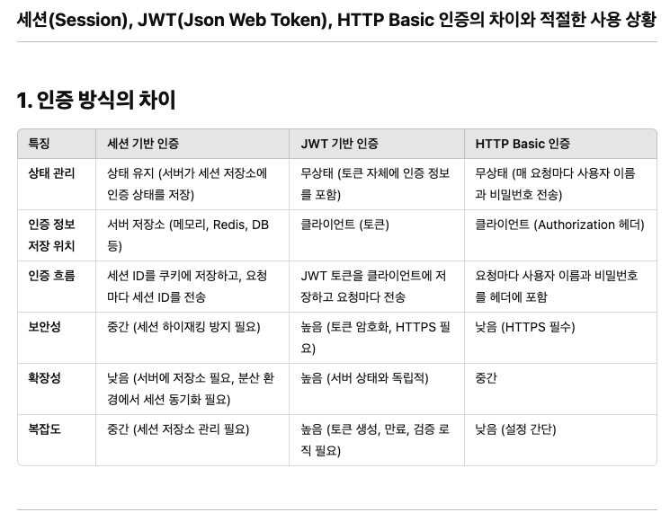

Spring Boot 서비스구조

## Entity(Domain)

- 데이터베이스에 쓰일 컬럼과 여러 Entity 간의 연관 관계를 정의 하는 클래스를 의미
- 데이터베이스의 테이블을 하나의 Entity로 생각해도 무방함
- 실제 데이터베이스의 테이블과 1:1로 매핑이 되도록 설계함
- 이 클래스의 필드는 각 테이블 내부의 컬럼(Columm)을 의미

## Repository

- Entity에 의해 생성된 데이터베이스 테이블에 접근하는 메소드를 사용하기 위한 인터페이스
- Service와 DB를 연결하는 고리의 역할을 수행
- 데이터베이스에 적용하고자 하는 CRUD를 정의하는 영역

## DAO(Data Access Object)

- 데이터베이스에 접근하는 객체를 의미(Persistance Layer)
- Service가 DB에 연결할 수 있게 해주는 역할
- DB를 사용하여 데이터를 조회하거나 조작하는 기능을 전담
- Repository와 마찬가지로

## DTO(Data Transfer Object)

- DTO는 VO(Value Object)로 불리기도 하며, 계층간 데이터 교환(Client → Controller → Service)
을 위한 객체를 의미(Entity와 달리 데이터베이스의 필드 값에 독립적이다.)
- VO의 경우 Read Only의 개념을 가지고 있음