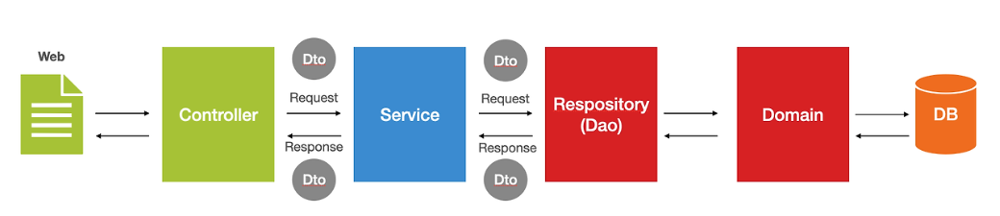
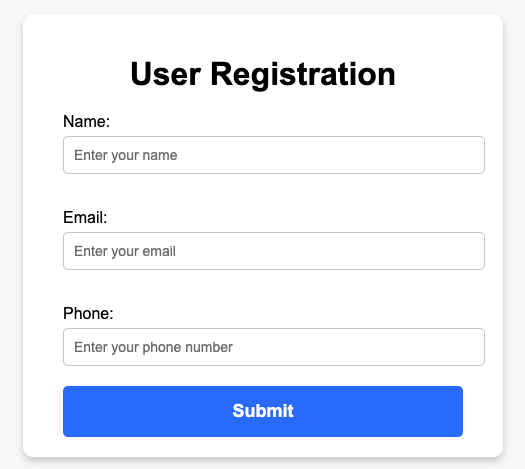
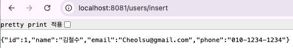

## Spring Boot 계층 흐름도


## Entity(Domain) - JPA
- Entiry 어노테이션 사용
- 데이터베이스에 쓰일 컬럼과 여러 Entity 간의 연관 관계를 정의 하는 클래스를 의미
- 데이터베이스의 테이블을 하나의 Entity로 생각해도 무방함
- 실제 데이터베이스의 테이블과 1:1로 매핑이 되도록 설계함
- 이 클래스의 필드는 각 테이블 내부의 컬럼(Columm)을 의미
___

### User(Entity)

```java
package My.Spring_Study.domain;

import jakarta.persistence.Column;
import jakarta.persistence.Entity;
import jakarta.persistence.GeneratedValue;
import jakarta.persistence.GenerationType;
import lombok.Getter;
import lombok.Setter;
import org.springframework.data.annotation.Id;

@Entity
@Getter
@Setter
public class User {
    @jakarta.persistence.Id
    @Id
    @GeneratedValue(strategy = GenerationType.IDENTITY) // 기본 키(primary key)를 자동으로 생성
    private Long id;

    @Column(nullable = false) // not null
    private String name;

    @Column(nullable = false, unique = true) // 컬럼의 값이 중복될 수 없음
    private String email;

    private String phone;

    // 기본 생성자 (필수)
    public User() {
    }

    // 모든 필드를 초기화하는 생성자
    public User(Long id, String name, String email, String phone) {
        this.id = id;
        this.name = name;
        this.email = email;
        this.phone = phone;
    }
}
```

___

만약 JPA를 사용하지 않는다면 User 클래스는 일반적인 Java 객체 (POJO)로 취급되어 데이터베이스와의 매핑은 개발자가 직접 SQL로 관리하여야 한다(DAO).
___

### User - POJO (Plain Old Java Object)

```Java
@Getter
@Setter
public class User {
    private Long id;
    private String email;
    private String name;
    private String phone;

     // 기본 생성자 (필수)
    public User() {
    }

    // 모든 필드를 초기화하는 생성자
    public User(Long id, String name, String email, String phone) {
        this.id = id;
        this.name = name;
        this.email = email;
        this.phone = phone;
}
```
___

## Repository
- Entity에 의해 생성된 데이터베이스 테이블에 접근하는 메소드를 사용하기 위한 인터페이스
- Service와 DB를 연결하는 고리의 역할을 수행
- 데이터베이스에 적용하고자 하는 CRUD를 정의하는 영역
___

```java
package My.Spring_Study.repository;

import My.Spring_Study.domain.User;
import org.springframework.data.jpa.repository.JpaRepository;
import org.springframework.stereotype.Repository;

@Repository
public interface UserRepository extends JpaRepository<User,Integer> {
}

```
___

Repository Interface는 데이터 베이스와 직접 소통하는 데이터 엑세스 계층이며 데이터 처리 및 추가적인 비즈니스 규칙이 적용되어야 하는 경우, Repository에서 직접 처리하면 코드가 복잡해지고 책임이 모호해진다.
하여 Service 계층을 만들어 비즈니스 로직을 분리하여 코드의 역할을 명확하게 하기 위해 사용된다.
즉, Service 레이어에서 UserRepository interface를 통해 쿼리문을 작성하지 않아도 DB에 접근하여 CRUD를 구현한다.
___

## Service 
- Service 어노테이션 사용
- 비즈니스 로직 처리
- 데이터 통합
- 트랙잭션 관리
- 유지보수성 향상
___

```java
package My.Spring_Study.service;

import My.Spring_Study.domain.User;
import My.Spring_Study.repository.UserRepository;
import org.springframework.stereotype.Service;

@Service
public class UserService {

    //객체 상태 저장
    private final UserRepository userRepository;

    //생성자 의존성 주입
    public UserService(UserRepository userRepository) {
        this.userRepository = userRepository;
    }
    
    public User insertUser(String name, String email, String phone){
        //User Entity
        User user = new User();
        user.setName(name);
        user.setEmail(email);
        user.setPhone(phone);

        return userRepository.save(user);
    }
}
```
___

User 정보를 받아와 DB에 저장하는 로직을 Service 레이어로 구현한다고 하였을 때 Service 레이어는 User정보를 Repository에 전달해야하기 때문에
Service 객체의 값이 DB에 저장하는 역할을 하는 UserRepository 객체를 UserService 객체에 주입시켜야 한다.
User 정보를 받아온 다음 userRepository.save(user)하게 되면 user 정보의 값이 들어가 있는 UserService 객체의 값이 UserRepository의 기본 메소드인 save를 사용하여 
DB에 User정보가 저장되게 된다.
___

## DAO(Data Access Object)
- 데이터베이스에 접근하는 객체를 의미(Persistance Layer)
- Service가 DB에 연결할 수 있게 해주는 역할
- DB를 사용하여 데이터를 조회하거나 조작하는 기능을 전담
- Repository와 마찬가지로 데이터베이스와 상호 작용을 담당
- JPA를 사용하지 않고 JDBC로 쿼리문을 작성하여 Repository의 역할을 함

### UserDAO (Repository)

```java
package My.Spring_Study.repository;

import My.Spring_Study.domain.User;

import java.sql.*;
import java.util.ArrayList;
import java.util.List;

public class UserDAO {
    private static final String DB_URL = "jdbc:mysql://localhost:3306/your_database_name";
    private static final String DB_USER = "your_username";
    private static final String DB_PASSWORD = "your_password";

    public User insertUser(User user) {
        String sql = "INSERT INTO User (name, email, phone) VALUES (?, ?, ?)";
        try (Connection connection = DriverManager.getConnection(DB_URL, DB_USER, DB_PASSWORD);
             PreparedStatement preparedStatement = connection.prepareStatement(sql, Statement.RETURN_GENERATED_KEYS)) {
            preparedStatement.setString(1, user.getName());
            preparedStatement.setString(2, user.getEmail());
            preparedStatement.setString(3, user.getPhone());
            preparedStatement.executeUpdate();

            ResultSet resultSet = preparedStatement.getGeneratedKeys();
            if (resultSet.next()) {
                user.setId(resultSet.getLong(1)); // 자동 생성된 ID 설정
            }

        } catch (SQLException e) {
            e.printStackTrace();
        }

        return user;
    }
```
___

### UserService

```java
package My.Spring_Study.service;

import My.Spring_Study.domain.User;
import My.Spring_Study.repository.UserDAO;

import java.util.List;

public class UserService {
    private final UserDAO userDAO = new UserDAO(); // DAO 객체 생성

    public User insertUser(String name, String email, String phone) {
        User user = new User();
        user.setName(name);
        user.setEmail(email);
        user.setPhone(phone);
        return userDAO.insertUser(user); // DAO 호출
    }
}
```
___

UserDAO는 JPA를 사용하지 않을때 Repository 역할을 하며 UserService에서는 UserDAO 객체를 생성하여 insertUser메서드를 사용한다. 
JPA는 메서드로 CRUD를 호출하는 반면 UserDAO는 JDBC URL을 사용하여 SQL쿼리를 직접 작성하여야 한다. SQL 쿼리를 직접 작성하는 만큼 SQL관련 에러처리를 직접적으로 해주어야 한다.(SQLException) 
SQL쿼리를 직접 작성하면 더욱 정교한 데이버테이스 접근 로직을 작성할 수 있지만 간단한 데이터 접근 로직(CRUD 등)을 구성할 경우에는 반복적으로 SQL문을 작성하여야 하기 때문에 코드를 작성하는데 번거러움이 있다.
하여 보통 JPA로 DB에 접근하며 JPA를 사용하지만 정교한 쿼리문을 작성해야 한다면 JPQL로 쿼리문을 작성하여 구현한다.

___

## Controller
- Controller 어노테이션 사용
- 클라이언트 요청 처리 (HTTP)
- 데이터 검증 및 전달 (URL mapping)
- 비즈니스 로직 요청 및 응답

### UserCotroller

```java
package My.Spring_Study.controller;

import My.Spring_Study.domain.User;
import My.Spring_Study.service.UserService;
import org.springframework.http.ResponseEntity;
import org.springframework.stereotype.Controller;
import org.springframework.web.bind.annotation.*;

@Controller
@RequestMapping("/users")
public class UserController {
    // 비즈니스 로직처리를 하는 UserService 의존성 주입
    private final UserService userService;

    public UserController(UserService userService) {
        this.userService = userService;
    }

    @GetMapping("/register")
        public String register(){
            return "register";
    }

    //사용자 등록 API
    @PostMapping("/insert")
    public ResponseEntity<User> createUser(
            @RequestParam(required = false) String name, //요청 파라미터 필수 x
            @RequestParam(required = false) String email, //요청 파라미터 필수 x
            @RequestParam(required = false) String phone) //요청 파라미터 필수 x
    {
        User user = userService.insertUser(name, email, phone);
        return ResponseEntity.ok(user);
    }
}

```
___

### register.html

```html
<!DOCTYPE html>
<html lang="en">
<head>
  <meta charset="UTF-8">
  <meta name="viewport" content="width=device-width, initial-scale=1.0">
  <title>User Registration</title>
  <style>
    body {
      display: flex;
      justify-content: center;
      align-items: center;
      height: 100vh;
      margin: 0;
      background-color: #f9f9f9;
      font-family: Arial, sans-serif;
    }

    .form-container {
      background-color: white;
      padding: 20px 40px;
      border-radius: 10px;
      box-shadow: 0 4px 8px rgba(0, 0, 0, 0.2);
      text-align: center;
      width: 100%; /* 반응형 */
      max-width: 400px; /* 최대 너비 설정 */
    }

    h1 {
      margin-bottom: 20px;
      font-weight: bold;
    }

    label {
      font-size: 16px;
      display: block;
      margin-top: 15px;
      text-align: left; /* 라벨 텍스트 왼쪽 정렬 */
    }

    input {
      width: 100%;
      padding: 10px;
      margin-top: 5px;
      margin-bottom: 20px; /* 버튼과의 간격 조정 */
      border: 1px solid #ccc;
      border-radius: 5px;
      font-size: 14px;
    }

    button {
      width: 100%;
      padding: 15px;
      background-color: #007BFF;
      color: white;
      font-size: 18px;
      font-weight: bold;
      border: none;
      border-radius: 5px;
      cursor: pointer;
    }

    button:hover {
      background-color: #0056b3;
    }
  </style>
</head>
<body>
<div class="form-container">
  <h1>User Registration</h1>
  <form action="/users/insert" method="post">
    <label for="name">Name:</label>
    <input type="text" id="name" name="name" placeholder="Enter your name">

    <label for="email">Email:</label>
    <input type="email" id="email" name="email" placeholder="Enter your email">

    <label for="phone">Phone:</label>
    <input type="text" id="phone" name="phone" placeholder="Enter your phone number">

    <button type="submit">Submit</button>
  </form>
</div>
</body>
</html>
```
___



___

컨트롤러에서 UserService 레이어의 insertUser 메서드를 사용하기 위해서 의존성을 주입하고 클라이언트의 역할을 하는 입력 양식인 register.html 페이지를 users/register 경로로 요청하여 반환한단.
반환된 register.html 에서 각 입력 양식을 작성하고 submit을 클릭하게 되면 users/insert 경로로 데이터를 보낸다(post). user/insert 경로가 요청되면 PostMapping으로 RequestParam을 통하여
post로 보낸 데이터를 받아 insertUser 메서드의 매개변수로 설정하여 userService에 구현된 DB저장 로직을 통해 DB에 저장된다. 즉, 저장된 데이터는 컨틀롤러로 받은 name, email, phone이 되는 것이다.

___

## DTO(Data Transfer Object)

- DTO는 VO(Value Object)로 불리기도 하며, 계층간 데이터 교환(Client → Controller → Service)을 위한 객체를 의미(Entity와 달리 데이터베이스의 필드 값에 독립적이다.)
- 데이터를 단순히 담고 전달하는 역할을 하며, 로직은 포함하지 않는다.
- 특정 상황에 필요한 데이터만 포함하도록 설계된 클래스이다.
- VO의 경우 Read Only의 개념을 가지고 있다.
___

### UserDTO

```java
package My.Spring_Study.DTO;

import lombok.Getter;
import lombok.Setter;

@Getter
@Setter
public class UserDTO {
    private Long id;
    private String name;
    private String email;
    private String phone;

    public UserDTO(Long id, String name, String email, String phone) {
        this.id = id;
        this.name = name;
        this.email = email;
        this.phone = phone;
    }
}
```
___

### UserService

```java
    package My.Spring_Study.service;

import My.Spring_Study.DTO.UserDTO;
import My.Spring_Study.domain.User;
import My.Spring_Study.repository.UserRepository;
import org.springframework.stereotype.Service;

@Service
public class UserService {

    //객체 상태 저장
    private final UserRepository userRepository;

    //생성자 의존성 주입
    public UserService(UserRepository userRepository) {
        this.userRepository = userRepository;
    }

    public UserDTO insertUser(UserDTO userDTO){
        //User Entity
        User user = new User();
        user.setName(userDTO.getName());
        user.setEmail(userDTO.getEmail());
        user.setPhone(userDTO.getPhone());
        
        User savedUser = userRepository.save(user);

        return new UserDTO(savedUser.getId(), savedUser.getName(), savedUser.getEmail(), savedUser.getPhone());
    }
}
```

### UserController

```java
package My.Spring_Study.controller;

import My.Spring_Study.DTO.UserDTO;
import My.Spring_Study.service.UserService;
import org.springframework.http.ResponseEntity;
import org.springframework.stereotype.Controller;
import org.springframework.web.bind.annotation.*;

@Controller
@RequestMapping("/users")
public class UserController {
    // 비즈니스 로직처리를 하는 UserService 의존성 주입
    private final UserService userService;

    public UserController(UserService userService) {
        this.userService = userService;
    }

    @GetMapping("/register")
        public String register(){
            return "register";
    }

    //사용자 등록 API
    @PostMapping("/insert")
    public ResponseEntity<UserDTO> createUser(@ModelAttribute UserDTO userDTO) // RequestParam으로 받아도 되지만 매개변수가 많아 질 수록 코드가 길어져 ModelAttribute를 통해 객체로 받음
    {
        UserDTO saveUser = userService.insertUser(userDTO);
        return ResponseEntity.ok(saveUser);
    }
}
```
___


___

DTO(Data Transfer Object)는 계층 간 데이터 전송을 위해 사용하는 객체이며 주로 Controller와 Service 간의 데이터 교환에 사용된다.
DTO를 사용하는 이유는 database와 직접 매핑되는 Entity를 노출하지 않기 위함이다. 즉, Entity 클래스를 직접 호출하여 데이터를 주고 받는 것이 아니라 DTO를 통해서 데이터를 주고받기 위함이다.
Entity를 직접 호출하여 데이터를 주고 받으면 보안과 유지보수성에 있어서 문제가 있다. 만약 password와 같은 민감한 정보가 Entity에 속해 있다면 클라이언트가 데이터를 요청 했을 때 password의 정보가 클라이언트에게
제공될 수 있기 때문에 password와 같은 민감한 정보를 제외한 데이터(name, email, phone)를 DTO 객체로 클라이언트에게 제공하는 것이다.
그리고 Entity는 database의 테이블 구조이기 때문에 database의 구조가 변경되면 이에 따라 Entity로 수정해야 하기에 API를 통한 클라이언트와의 데이터 교환에도 영향을 미치기 때문에 DTO를 사용하여 
각 요청에 따른 필요한 데이터만 불러와 클라이언트와의 데이터 교환을 안정적으로 유지할 수 있다(데이터 무결성).

___


## 스프링의 각 서비스 구조는 역할과 책임을 분리함으로써 서로 독립적인 관계를 유지하여 코드의 유지보수성과 확장성을 높이는 것을 목표로 한다.

